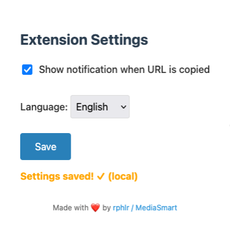
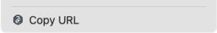
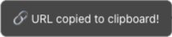

# URL Copier – Firefox Extension

<p align="center">
    
</p>

**A minimalist browser extension to copy the current tab's URL with Cmd+Shift+C / Ctrl+Shift+C.**  
Stop triggering DevTools by accident. Lightweight, privacy-friendly, and blazing fast.

---

## 📸 Screenshots

<div align="center">
    <table>
        <tr>
            <td align="center">
                
                <br><em>Extension settings</em>
            </td>
            <td align="center">
                
                <br><em>Right-click context menu</em>
            </td>
            <td align="center">
                
                <br><em>Copy confirmation</em>
            </td>
        </tr>
    </table>
</div>

---

## 🔧 Features

- ⌨️ Copy current tab URL via `Cmd+Shift+C` / `Ctrl+Shift+C`
- 🖱️ Right-click context menu with "Copy URL" option
- 🌍 Multilingual support (English & French) with real-time switching
- 🛑 Prevents DevTools from opening with this shortcut
- 🔔 In-page visual feedback (non-intrusive notifications)
- ⚙️ Configurable settings page for notifications and language
- 🔒 Privacy-first: no tracking, no data collection
- 💾 Robust storage with localStorage fallback
- ✅ Works on all websites

---

## 🚀 Install

**[Install from Firefox Add-ons](https://addons.mozilla.org/fr/firefox/addon/url-copier/)**

For development, you can install manually:
1. Clone or download this repo
2. Build the XPI: `make build`
3. Go to `about:debugging` > This Firefox > Load Temporary Add-on
4. Select the generated `.xpi` file from the `dist/` folder

Alternatively, for direct development:
- Go to `about:debugging` > This Firefox > Load Temporary Add-on
- Select `manifest.json` directly from the `src/` folder

---

## 🛠️ Build (.xpi)

To build the extension locally from source:

```bash
make build
```

This will create a `.xpi` archive in the `dist/` folder.

To clean the build:

```bash
make clean
```

Ensure `manifest.json` and all source files are inside the `src/` directory before building.

---

## ⚙️ Configuration

Access settings via the extension icon or `about:addons` > URL Copier > Preferences.

**Available options:**
- Toggle notification display when URL is copied
- Switch between English and French interface
- Settings are automatically saved and synced

---

## 🧪 Use Case

Perfect for developers, researchers, and power users who frequently copy URLs and want a cleaner keyboard workflow. Ideal for:

- Quick URL sharing during development
- Research and reference collection
- Content creation workflows
- Anyone tired of accidentally opening DevTools

---

## 📜 License

[MIT](LICENSE)